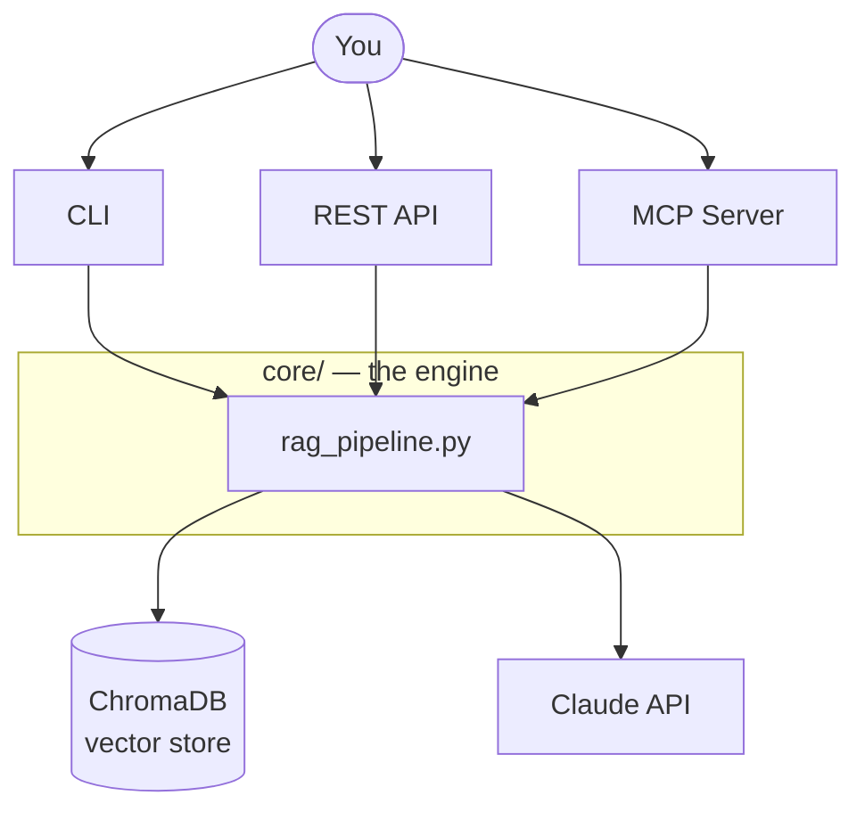
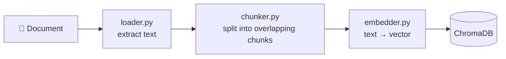
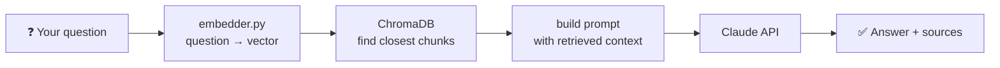
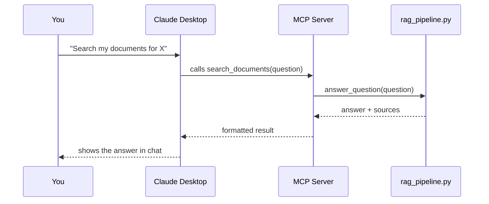

> **Status note:** this README documents the plan. Checkboxes below get ticked off only once that piece is actually built *and* tested — not before.

Ask questions about your own documents — PDFs, text files, markdown notes — and get answers grounded in what those documents actually say, not the AI's general knowledge and not a guess. Built using **RAG (Retrieval-Augmented Generation)**.

## Table of Contents
- [The Big Picture](#the-big-picture)
- [How It Will Work](#how-it-will-work)
- [Roadmap](#roadmap)
- [Planned Tech Stack](#planned-tech-stack)
- [Why I'm Building This](#why-im-building-this)
- [Setup](#setup)

## The Big Picture

One engine, three ways to use it.

All three interfaces call the exact same underlying engine — nothing is duplicated between them.

## How It Will Work

**Adding a document (indexing):**

**Asking a question (query):**

**Asking through Claude Desktop (MCP):**

## Roadmap

- [x] Project folder + git + GitHub connected
- [ ] Virtual environment + dependencies
- [ ] Document loader (PDF/TXT/MD → text)
- [ ] Chunking (splitting text into searchable pieces)
- [ ] Embeddings (text → numbers, for semantic search)
- [ ] Vector storage (ChromaDB)
- [ ] RAG pipeline (retrieval + Claude API answer generation)
- [ ] Command-line interface
- [ ] REST API (FastAPI)
- [ ] MCP server (Claude Desktop integration)
- [ ] Automated tests
- [ ] Security review (auth, file validation, prompt injection)
- [ ] Optional: RAG quality evaluation (RAGAS)

## Planned Tech Stack

| Piece | Tool | Why |
|---|---|---|
| PDF reading | pypdf | pulls text out of PDF files |
| Embeddings | sentence-transformers | free, runs locally, no API cost |
| Vector storage | ChromaDB | stores + searches embeddings, no server setup needed |
| Answer generation | Claude API | writes the final answer, grounded in retrieved text |
| REST API | FastAPI | exposes this over HTTP, with free auto-generated docs |
| Desktop integration | MCP | lets Claude Desktop call this project directly as a tool |

## Why I'm Building This

<!-- your own words — a sentence or two on why this project, what you wanted to learn -->

## Setup

<!-- filled in once there's actually something to set up -->